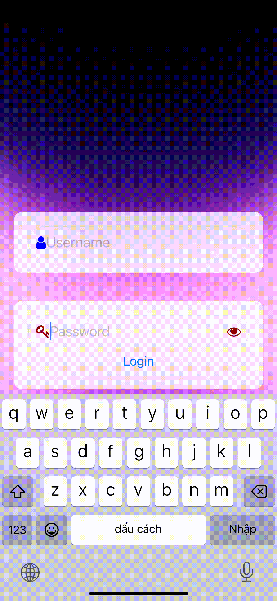

[](https://www.npmjs.com/package/@tdduydev/react-native-unsigned-input) [](https://snyk.io/test/github/tdduydev/react-native-unsigned-input)

# react-native-unsigned-input

1. Normalizing the input string by removing Vietnamese diacritics and whitespaces:

- This algorithm takes an input string and performs the following steps:

  a. Decomposes the string into its canonical form using `decomposedStringWithCanonicalMapping`. This breaks the string into its base characters and their combining marks (diacritics).

  b. Folds the diacritic marks using 1stringByFoldingWithOptions:NSDiacriticInsensitiveSearch`. This step replaces characters with diacritics with their base forms, effectively removing the diacritic marks.

  c. Trims the whitespaces at the beginning and the end of the string using `stringByTrimmingCharactersInSet:[NSCharacterSet whitespaceCharacterSet]`. The result of this algorithm is a normalized string without diacritics and extra whitespaces.

2. Replacing the input string in the text field with the normalized string:

- This algorithm updates the text field's content by replacing the characters in a specified range with the normalized string. This is done using the `stringByReplacingCharactersInRange:range withString:normalizedString` method. As a result, the text field will display the normalized version of the input string, without diacritics and extra whitespaces.

In summary, these two algorithms work together to process a text input by removing Vietnamese diacritics and extra whitespaces, then updating the text field with the normalized string.

## Demo



## Installation

Make sure to install the `@tdduydev/react-native-unsigned-input` package and link it with your project.

```sh
npm install react-native-unsigned-input --save
```

## Usage

```jsx
import InputBlurUnsigned from '@tdduydev/react-native-unsigned-input';

// In your JSX
<InputBlurUnsigned
  placeholder="Enter text"
  leftIcon={<YourLeftIcon />}
  rightIcon={<YourRightIcon />}
  onChangeText={(text) => console.log(text)}
/>;
```

## Props

<table>
  <thead>
    <tr>
      <th>Prop</th>
      <th>Type</th>
      <th>Description</th>
    </tr>
  </thead>
  <tbody>
    <tr>
      <td>secureTextEntry</td>
      <td>Boolean</td>
      <td>If set to true, the text entered will be obscured, typically used for password fields.</td>
    </tr>
    <tr>
      <td>style</td>
      <td>Object</td>
      <td>Additional styles to be applied to the TextInput component.</td>
    </tr>
    <tr>
      <td>multiline</td>
      <td>Boolean</td>
      <td>If set to true, the TextInput will allow multiple lines of text.</td>
    </tr>
    <tr>
      <td>rightIcon</td>
      <td>ReactElement</td>
      <td>A React element to be displayed as the right icon within the TextInput field.</td>
    </tr>
    <tr>
      <td>leftIcon</td>
      <td>ReactElement</td>
      <td>A React element to be displayed as the left icon within the TextInput field.</td>
    </tr>
    <tr>
      <td>rightIconContainerStyle</td>
      <td>Object</td>
      <td>Additional styles to be applied to the right icon container.</td>
    </tr>
    <tr>
      <td>leftIconContainerStyle</td>
      <td>Object</td>
      <td>Additional styles to be applied to the left icon container.</td>
    </tr>
    <tr>
      <td>value</td>
      <td>String</td>
      <td>The value of the TextInput field.</td>
    </tr>
    <tr>
      <td>defaultValue</td>
      <td>String</td>
      <td>The initial value of the TextInput field.</td>
    </tr>
    <tr>
      <td>onChangeText</td>
      <td>Function</td>
      <td>A function to be called when the text changes in the TextInput field.</td>
    </tr>
    <tr>
      <td>placeholder</td>
      <td>String</td>
      <td>A placeholder string to be displayed when the TextInput field is empty.</td>
    </tr>
    <tr>
      <td>placeholderTextColor</td>
      <td>String</td>
      <td>The color of the placeholder text.</td>
    </tr>
    <tr>
      <td>onGetValue</td>
      <td>Function</td>
      <td>A function to be called when the value of the TextInput field is retrieved.</td>
    </tr>
    <tr>
      <td>onFocus</td>
      <td>Function</td>
      <td>A function to be called when the TextInput field receives focus.</td>
    </tr>
    <tr>
      <td>onBlur</td>
      <td>Function</td>
      <td>A function to be called when the TextInput field loses focus.</td>
    </tr>
    <tr>
      <td>...rest</td>
      <td>Any</td>
      <td>Additional props to be passed down to the TextInput component.</td>
    </tr>
    <tr>
      <td>backgroundInput</td>
      <td>ReactElement</td>
      <td>No</td>
      <td>A React Element used as a background input for iOS platform</td>
    </tr>
  </tbody>
</table>

# Styling

The component has built-in styling for the TextInput and its container. To customize the styling, use the `style`, `rightIconContainerStyle`, and `leftIconContainerStyle` props as needed.

The `backgroundInput` prop is used to provide a custom background input for the iOS platform. This prop should be a React Element, and it is optional. If provided, the background input element will be rendered behind the main `TextInput` component on iOS devices. This can be useful for adding a custom appearance or styling to the input field on iOS.

## Methods

`focus`: This method can be called to focus the TextInput field programmatically. To use it, create a ref for the component and call the `focus` method on the ref:

```jsx
const inputRef = useRef();

// Somewhere in your code
inputRef.current.focus();

// In your JSX
<InputBlurUnsigned ref={inputRef} ... />

```

Regenerate response

See the [contributing guide](CONTRIBUTING.md) to learn how to contribute to the repository and the development workflow.

## License

MIT

---

# Donate

A cup of coffee helps me have more motivation to develop more useful plugins, Thank you

[](https://www.buymeacoffee.com/tdduydev)

[](https://paypal.me/tduydev)
